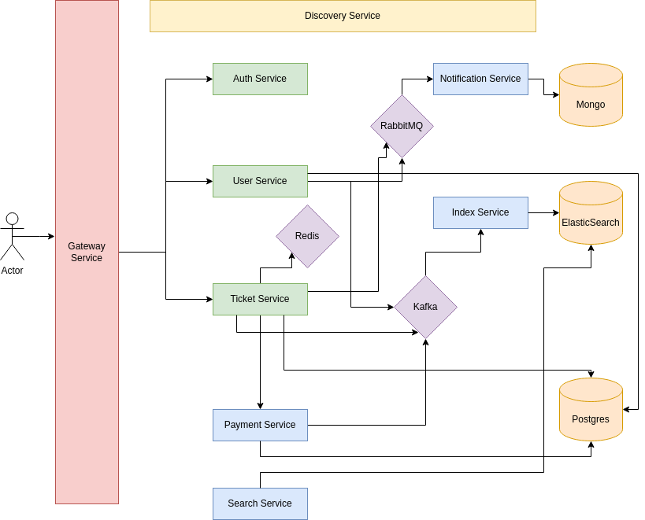
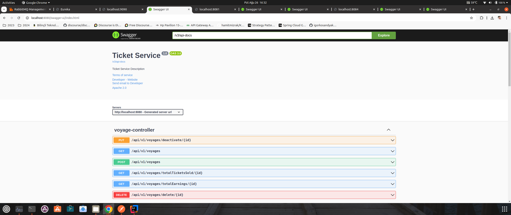

# Patika.dev & FT Teknoloji Fullstack Bootcamp Bitirme Projesi

## Proje Konusu
Online uçak ve otobüs bileti satışı yapılmak istenmektedir. Uygulamanın gereksinimleri
aşağıdaki gibidir.

### Gereksinimler
- Kullanıcılar sisteme kayıt ve login olabilmelidir.
- Kullanıcı kayıt işleminden sonra mail gönderilmelidir.
- Kullanıcılara role atanıp, silinebilir.
- Admin kullanıcısı yeni sefer ekleyebilir, iptal edebilir, toplam bilet satışını, bu satıştan elde edilen toplam ücreti görebilir. (Admin kullanıcıları uygulamadaki bilgileri
görebilir.)
- Kullanıcılar şehir bilgisi, taşıt türü(uçak & otobüs) veya tarih bilgisi ile tüm seferleri
arayabilmelidir.
- Bireysel kullanıcı aynı sefer için en fazla 5 bilet alabilir.
- Bireysel kullanıcı tek bir siparişte en fazla 2 erkek yolcu için bilet alabilir.
- Kurumsal kullanıcı aynı sefer için en fazla 40 bilet alabilir.
- Satın alma işlemi başarılı ise bilet bilgileri kullanıcının telefonuna sms ve varsa
email gönderilmeli.
- Kullancılar sadece kendi bilgilerine ulaşabilir.

### Teknik Gereksinimler
- SMS, mail ve push Notification gönderme işlemleri için sadece Database kayıt
etme işlemi yapılması yeterlidir.(İsteyenler ücretsiz uygulamalar ile gerekli
entegrasyonu yapabilir) Fakat bu işlemler tek bir Servis(uygulama) üzerinden ve
strateji pattern ile yapılmalıdır
- Kullanıcı şifresi SHA-512 algoritmasıyla hashlenerek kaydedilmelidir.
- Microservice mimarisine uygun geliştirilmelidir.
- Performans problemleri oluşmaması için geliştirmeler eklenmelidir.Sistem Kabulleri

### Sistem Kabulleri
- Kullanıcılar bireysel ve kurumsal olabilir.
- SMS, Mail ve Push Notification gönderim işlemleri Asenkron olmalıdır.
- Uçak yolcu kapasitesi: 189
- Otobüs yolcu kapasitesi: 45
- Ödeme şekli sadece Kredi kartı ve Havale / EFT olabilir.
- Ödeme Servisi işlemleri Senkron olmalıdır.

### Kullanılacak Teknolojiler
- Min Java 11
- Spring Boot
- JUnit5
- RabbitMQ
- PostgreSql / MySql / MongoDb (ihtiyaca göre kullanabilirsiniz)
- Redis
- JWT Token

## Proje Mimarisi
Aşağıdaki diagramda görüldüğü üzere proje isterleri, güvenlik ve performans gibi kapsamlar düşünülerek mikro servis mimarisi oluşturuldu. 
Buradaki servisleri diagramın altında birkaç kelime ile açıklaması vardır. 

### Discovery Service
Bu mikro servis Eureka server kullanır ve diğer mikroservislerin kayıt olmasını ve 
kayıtlı mikroservislerin birbirini ile tanımasını sağlar, 
bu sayede port haricinde loadbalancer yapılmasını destekler. 

### Gateway Service
Bu mikro servis ile kullandığı port üzerinden diğer mikro servislere 
yönlendirme yapar, güvenlik için bir gateway authentication filter kullanıldı. 
Bu filtre auth servis de üretilen token'ı jwt util ile çözer ve kullanıcı rol kontrölü yapar. 
Bu kontrole göre kullanıcı ilgili mikro servis api'lerine yetkilendirilebilir. 

### Auth Service
Bu mikro servis kullanıcılara register ve ve login işlemleri sağlar, 
gelen isteği user servis ile feign client yöntemiyle konuşarak 
yeni kullanıcı oluşturur veya doğrular, ve gateway servise token gönderir. 

### User Service
Bu mikro servis de kullanıcılar oluşturulabilir, düzenlenebilir, silinebilir. 
Ayrıca rol atama, düzenle, silme yapılabilir. Veritabanı olarak postgre kullanır. 

### Ticket Service
Bu mikros servis projenin ana ürünüdür. Projenin ürün gereksinim ve isterlerinin 
olduğu servistir. Sefer ekleme, iptal, çıkarma, rezervasyon yapma, bilet oluşturma gibi
işlemleri sağlar. Veritabanı olarak postgre kullanır. 
Ayrıca performans için redis ile cache yapısı kullanır. 

### Ticket Service
Bu mikro servis ticket servisi ile feign client yoluyla konuşur. Senkron olarak ödeme
işlemlerini gerçekleştirir. Veritabanı olarak postgre kullanır. 

### Notification Service
Bu mikro servis SMS, MAIL, PUSH için strategy pattern kullanılarak oluşturulmuştur. 
Rabbitmq ile konuşarak asenkron çalışır. Veritabanı olarak mongo kullanır. 

### Index Service
Bu mikro servis diğer mikro servislerden kafkaya gönderilen veriyi tüketir ve 
elasticsearch nosql veritabanına kaydeder. 

### Search Service
Bu mikro servis index servis' in elasticsearch'e kaydettiği 
exception ve log'ları aramayı sağlar.

## Kurulum ve Çalıştırma
1. Terminalinizi açın ve projenin ana dizinine gidin.
2. Ana dizinin içinde docker-containers dizinine gidin
3. docker-containers dizini içindeki tüm dizinlere girerek `docker-compose up -d` komutunu çalıştırın.
4. Tüm docker konteynırların çalıştığından emin olun
3. Tüm spring boot servisleri sırası önemli değil çalıştırın. (Epey sürebilir, sabırlı olun...)
4. Tüm servislerin başladığından emin olun.
5. Artık projedeki tüm mikro servisler kullanılabilir. 

# Ekran Görüntüleri
## Gateway API Postman Collection
[Ticket Service Gateway API.postman_collection.json](Ticket%20Service%20Gateway%20API.postman_collection.json)

## Eureka Server

## API Swagger
### Auth Service

### Auth Service

### Auth Service

### Auth Service

### Auth Service

